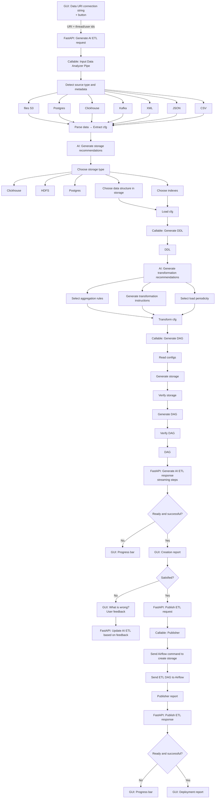

# 🎯 AI Data Assistant

A comprehensive AI-powered assistant for automating data engineering processes, capable of connecting to various data sources, building ETL pipelines, designing data warehouses, and optimizing processing performance.

## 📜 Table of Contents

- [Architecture](#-architecture)
- [Project Structure](#-project-structure)
- [Development](#-development)
- [Development Setup](#-development-setup)
- [Contributing](#-contributing)
- [Acknowledgments](#-acknowledgments)

## 📁 Project Structure

```
AITHachathon/
├── backend/                   # Python backend application
├── frontend/                  # Frontend application
├── docker-compose.yaml        # Main orchestration file
└── README.md                  # This file
```

## 🏗️ Proposed Solution and Architecture



For a detailed representation, refer to the [Miro board](https://miro.com/app/board/uXjVJF7uF_o=/).

### Where All This Stuff Is Implemented or Proposed to Be Implemented

#### UI
[`frontend/`](frontend/) - UI for all our mad stuff. Stakeholders: Daniil.

#### FastAPI app
[`backend/app/app.py`](backend/app/app.py) - would handle ETL generation/update/publish requests. Stakeholders: Gregory.

#### AI pipelines
[`backend/ai/`](backend/ai/) - would contain the AI-related logic and processing. **Attention**: committed usage of simple LangChain pipelines without memory for now with Dima - we may need to exclude checkpointer setup in [`backend/app/app.py`](backend/app/app.py) for now. Stakeholders: Gregory and Dima.

#### ExtractConfig model
[`backend/models/extract.py`](backend/models/extract.py) - describes source data storage, metamodels for objects in the storage, and some additional metadata. Stakeholders: Anton.

#### TransformConfig model
[`backend/models/transform.py`](backend/models/transform.py) - describes transformation instructions, aggregation rules, load periodicity, and some additional metadata. Stakeholders: Nikita.

#### LoadConfig model
[`backend/models/load.py`](backend/models/load.py) - describes target data storage, data structure in the storage, indexes, and some additional metadata. Stakeholders: Anton and Nikita.

#### ExtractConfig builders
[`backend/builders/extract/`](backend/builders/extract/) - would contain builders for various data sources to build ExtractConfig. Each builder is inherited from [`BaseExtractConfigBuilder`](backend/builders/extract/__init__.py) and should implement 3 methods for getting data shard type, metamodel for each data shard, and optional method for getting any additional useful metadata. **Attention**: some builders like `backend/builders/extract/hadoop.py`, `.../sparkstreaming.py` would not be implemented during hackathon. Stakeholders: Anton, Gregory, Nikita, Daniil, Julia.

#### DDL generation
[`backend/builders/ddl.py`](backend/builders/ddl.py) - would generate DDL based on ExtractConfig and LoadConfig. Stakeholders: Anton.

#### DAG generation
[`backend/builders/dag.py`](backend/builders/dag.py) - would generate Airflow DAG based on ExtractConfig, TransformConfig, LoadConfig, and DDL. Stakeholders: Nikita.

#### DAG execution
[`backend/executors/dag.py`](backend/executors/dag.py) - would handle the execution of the generated DAGs. **Attention**: probably, would include `DAG generation` part as well. Stakeholders: Nikita.

## 🚀 Deployment

### Prerequisites

- **Docker & Docker Compose**: For containerized deployment
- **Yandex Cloud Account**: For AI services
- **Git**: For cloning the repository

### Installation & Setup

1. **Clone the repository:**
```bash
git clone https://github.com/PE51K/lct-hack-2025
cd lct-hack-2025
```

2. **Set up environment variables:**
```bash
# Backend configuration (use .env.prod.example for production)
cp backend/.env.prod.example backend/.env
# Edit backend/.env with your settings

# Frontend configuration (use .env.prod.example for production)
cp frontend/.env.prod.example frontend/.env
# Edit frontend/.env with your settings
```

- Refer to the [`backend/.env.dev.example`](backend/.env.dev.example) and [`frontend/.env.dev.example`](frontend/.env.dev.example) files for variable descriptions.

3. **Start all services:**
```bash
docker compose up --build -d
```

4. **Access the services:**
- Frontend: `http://localhost:{port_from_frontend_env}`
- Backend API: `http://localhost:{port_from_backend_env}/docs`

## 🛠️ Development Setup

Refer to [Backend Documentation](backend/README.md) and [Frontend Documentation](frontend/README.md) for detailed development instructions.

## 🤝 Contributing

1. Fork the repository
2. Create a feature branch: `git checkout -b feature/your-feature`
3. Make your changes
4. Format backend code: `cd backend && uv run ruff format && uv run ruff check --fix`
5. Format frontend code: `cd frontend && npm run lint`
6. Commit your changes: `git commit -am 'Add new feature'`
7. Push to the branch: `git push origin feature/your-feature`
8. Submit a pull request

## 🙏 Acknowledgments

- **Yandex Cloud** for AI foundation models and embeddings
- **LangChain** for LLM orchestration framework
- **LangGraph** for agent workflow orchestration
- **LangFuse** for AI observability platform

---

**Happy Hacking! 🚀**
