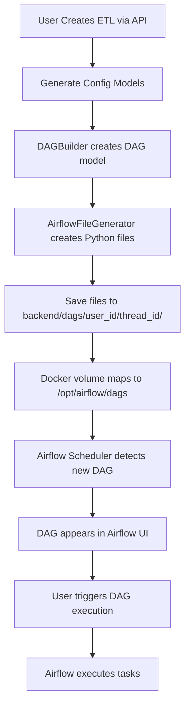

# DAG File Generation Analysis & Implementation Plan

## Executive Summary

This document analyzes the feasibility of adapting DAG building from [`backend/stuff`](../stuff) to implement file-based DAG generation in [`backend/builders/dag`](../builders/dag), storing generated files in `backend/dags/user_id/thread_id` for Airflow execution.

**Key Findings:**
- ✅ **Feasible**: Adaptation is highly feasible with clear implementation path
- ✅ **Files Required**: Yes, Airflow needs physical Python files to execute DAGs
- ⚠️ **Config Changes**: Minor enhancements needed to current configs
- ✅ **Execution Strategy**: Clear path via docker volume mounting

---

## 1. Current State Analysis

### 1.1 Current Implementation ([`backend/builders/dag/builder.py`](../builders/dag/builder.py))

**Purpose**: Creates a [`DAG`](../models/dag.py:38) model (JSON-serializable configuration)

**Key Characteristics**:
- Returns Pydantic [`DAG`](../models/dag.py:38) model with metadata
- Generates 3 tasks: extract → transform → load
- Estimates resources (CPU, memory, runtime)
- Creates documentation in Markdown format
- **Does NOT generate executable Python files**

**Current Output**:
```python
DAG(
    dag_id="etl_source_target_20231002_001234",
    tasks=[
        DAGTask(task_id="extract_data", ...),
        DAGTask(task_id="transform_data", ...),
        DAGTask(task_id="load_data", ...)
    ],
    schedule="@daily",
    ...
)
```

### 1.2 Reference Implementation ([`backend/stuff/dag_generation`](../stuff/dag_generation))

**Purpose**: Creates complete, executable Airflow DAG file system

**Key Components**:

1. **[`etl_dag_system.py`](../stuff/dag_generation/etl_dag_system.py)** - Main orchestrator
2. **[`enhanced_airflow_generator.py`](../stuff/dag_generation/enhanced_airflow_generator.py)** - File generation engine
3. **[`comprehensive_dag_builder.py`](../stuff/dag_generation/comprehensive_dag_builder.py)** - Configuration builder
4. **[`pipeline_config_models.py`](../stuff/dag_generation/pipeline_config_models.py)** - Enhanced data models

**Generated Files per Pipeline**:
```
backend/stuff/demo_output/etl_demo_geospatial_xml_processing/
├── etl_demo_geospatial_xml_processing_config.json    # Full config
├── etl_demo_geospatial_xml_processing_report.md      # Documentation
└── airflow/
    ├── etl_demo_geospatial_xml_processing.py         # Main DAG file ⭐
    ├── etl_demo_geospatial_xml_processing_functions.py  # Task functions
    ├── etl_demo_geospatial_xml_processing_config.py     # Config constants
    ├── requirements.txt                               # Dependencies
    └── etl_demo_geospatial_xml_processing_deployment.md # Deployment guide
```

### 1.3 Airflow Docker Setup ([`backend/docker-compose.airflow.yaml`](../docker-compose.airflow.yaml))

**Key Configuration**:
```yaml
airflow:
  image: apache/airflow:2.8.0
  volumes:
    - ${AIRFLOW_DAGS_VOLUME}:/opt/airflow/dags     # ⭐ DAG files directory
    - ${AIRFLOW_LOGS_VOLUME}:/opt/airflow/logs
  environment:
    AIRFLOW__SCHEDULER__DAG_DIR_LIST_INTERVAL: 30   # Scans for new DAGs every 30s
```

**Critical Insight**: Airflow watches `/opt/airflow/dags` directory and automatically loads Python files as DAGs.

---

## 2. Answering Your Questions

### 3.1) Is it possible to adapt DAG building from backend/stuff?

**Answer: ✅ YES - Highly Feasible**

**Reasoning**:

1. **Compatible Architecture**: Both systems use similar Pydantic models
2. **Clear Separation**: File generation logic is isolated in [`EnhancedAirflowDAGGenerator`](../stuff/dag_generation/enhanced_airflow_generator.py:25)
3. **Proven Implementation**: `backend/stuff` has working examples with real XML processing
4. **Reusable Components**: Can leverage existing models from current implementation

**Adaptation Strategy**:
- Extract file generation logic from [`EnhancedAirflowDAGGenerator`](../stuff/dag_generation/enhanced_airflow_generator.py:25)
- Create new [`AirflowFileGenerator`](../builders/dag/file_generator.py) class in `backend/builders/dag/`
- Integrate with existing [`DAGBuilder`](../builders/dag/builder.py:15) to extend functionality
- Store files in `backend/dags/{user_id}/{thread_id}/`

### 3.2) Do we need to store DAG files to further execute?

**Answer: ✅ YES - Absolutely Required**

**Reasoning**:

1. **Airflow Architecture**: Airflow requires **physical Python files** in the DAGs directory
   - The Airflow scheduler scans the DAGs directory every 30 seconds
   - It imports Python files and registers DAG objects
   - No files = No execution possible

2. **What Airflow Needs**:
   ```python
   # This must be a PHYSICAL FILE at /opt/airflow/dags/my_dag.py
   from airflow import DAG
   
   dag = DAG(
       'my_etl_pipeline',
       schedule_interval='@daily',
       ...
   )
   # Task definitions...
   ```

3. **Docker Volume Mapping**:
   ```yaml
   # docker-compose.airflow.yaml
   volumes:
     - ./backend/dags:/opt/airflow/dags  # Maps local directory to Airflow
   ```

4. **File Storage Structure**:
   ```
   backend/dags/
   ├── user_123/
   │   ├── thread_456/
   │   │   ├── etl_pipeline_123_456.py           # Main DAG file ⭐
   │   │   ├── etl_pipeline_123_456_functions.py # Task implementations
   │   │   ├── etl_pipeline_123_456_config.py    # Configuration
   │   │   └── __init__.py                       # Makes it a package
   │   └── thread_789/
   │       └── ...
   └── user_456/
       └── ...
   ```

**Storage Rationale**:
- **User Isolation**: Separate DAGs by user for multi-tenancy
- **Thread Isolation**: Each conversation thread gets its own namespace
- **Version Control**: Easy to track changes per thread
- **Cleanup**: Simple to delete old/unused pipelines

### 3.3) Is our config enough or should we change them?

**Answer: ⚠️ Minor Enhancements Needed**

**Current Config Gaps**:

| Component | Current State | Enhancement Needed |
|-----------|---------------|-------------------|
| **[`ExtractConfig`](../models/extract.py)** | Basic source metadata | ✅ Add `schedule`, `data_quality`, `resources` |
| **[`TransformConfig`](../models/transform.py)** | Transformation rules | ✅ Add `processing_mode`, `quality_checks` |
| **[`LoadConfig`](../models/load.py)** | Target storage info | ✅ Add `quality_checks`, `resources` |
| **[`DDL`](../models/ddl.py)** | SQL statements | ✅ Good as-is |
| **[`DAG`](../models/dag.py:38)** | Basic DAG metadata | ⚠️ Missing file generation info |

**Required Model Enhancements**:

```python
# Addition to DAG model (backend/models/dag.py)
class DAG(BaseModel):
    # ... existing fields ...
    
    # NEW: File generation support
    generated_files: dict[str, str] | None = Field(
        None, 
        description="Paths to generated Airflow files"
    )
    dag_file_content: str | None = Field(
        None,
        description="Generated Python DAG code"
    )
    functions_file_content: str | None = Field(
        None,
        description="Generated task functions code"
    )
```

**Configuration Mapping Strategy**:

```python
# Map current models to enhanced models for file generation
def map_to_enhanced_config(
    extract_config: ExtractConfig,
    transform_config: TransformConfig,
    load_config: LoadConfig,
    ddl: DDL,
    dag: DAG,
    ids: ThreadUserIds
) -> EnhancedPipelineConfig:
    """Map current models to file generation format."""
    return EnhancedPipelineConfig(
        metadata=PipelineMetadata(
            pipeline_id=f"etl_{ids.user_id}_{ids.thread_id}",
            pipeline_name=dag.dag_id,
            owner=dag.owner,
            team=dag.team,
            # ... map other fields
        ),
        extract_config=enhance_extract_config(extract_config),
        transform_config=enhance_transform_config(transform_config),
        load_config=enhance_load_config(load_config),
        # ...
    )
```

### 3.4) How would we execute DAG later with Airflow docker service?

**Answer: ✅ Clear Execution Path**

**Execution Flow**:



**Step-by-Step Execution**:

1. **Generate DAG Files** (via API endpoint):
   ```python
   # POST /create_etl
   {
       "ids": {"user_id": "123", "thread_id": "456"},
       "user_prompt": "Extract XML from S3, transform, load to Postgres"
   }
   ```

2. **Files Created**:
   ```
   backend/dags/123/456/
   ├── etl_123_456.py              # ← Airflow imports this
   ├── etl_123_456_functions.py
   └── etl_123_456_config.py
   ```

3. **Airflow Auto-Discovery** (within 30 seconds):
   - Scheduler scans `/opt/airflow/dags/`
   - Finds `etl_123_456.py`
   - Imports and registers DAG

4. **Execution Options**:

   **Option A: Trigger via Airflow UI**
   ```
   http://localhost:8081/  # Default Airflow port
   Navigate to DAGs → etl_123_456 → Trigger DAG
   ```

   **Option B: Trigger via Airflow API**
   ```python
   import requests
   
   # Trigger DAG execution
   response = requests.post(
       "http://localhost:8081/api/v1/dags/etl_123_456/dagRuns",
       auth=("admin", "admin"),
       json={"conf": {}}
   )
   ```

   **Option C: Trigger via CLI**
   ```bash
   docker exec -it airflow airflow dags trigger etl_123_456
   ```

5. **Monitoring**:
   ```python
   # Check DAG status via API
   GET http://localhost:8081/api/v1/dags/etl_123_456/dagRuns
   ```

**Volume Configuration**:
```yaml
# backend/.env
AIRFLOW_DAGS_VOLUME=./backend/dags

# docker-compose.airflow.yaml
volumes:
  - ${AIRFLOW_DAGS_VOLUME}:/opt/airflow/dags
```

---

## 3. Implementation Architecture

### 3.1 Proposed File Structure

```
backend/
├── builders/
│   └── dag/
│       ├── __init__.py
│       ├── builder.py              # Existing: Creates DAG model
│       ├── file_generator.py       # NEW: Generates Airflow files ⭐
│       └── templates/              # NEW: Jinja2 templates ⭐
│           ├── dag_template.py.j2
│           ├── functions_template.py.j2
│           └── config_template.py.j2
├── dags/                           # NEW: Generated DAG files ⭐
│   ├── .gitignore                  # Ignore generated files
│   ├── README.md                   # Explains structure
│   └── {user_id}/
│       └── {thread_id}/
│           ├── etl_{user_id}_{thread_id}.py
│           ├── etl_{user_id}_{thread_id}_functions.py
│           ├── etl_{user_id}_{thread_id}_config.py
│           └── __init__.py
├── models/
│   └── dag.py                      # Enhanced with file paths
└── app/
    └── routers/
        ├── create_etl.py           # Modified: Add file generation
        └── publish_etl.py          # NEW: Publish DAG to Airflow ⭐
```

### 3.2 Component Design

#### Component 1: AirflowFileGenerator

**Location**: [`backend/builders/dag/file_generator.py`](../builders/dag/file_generator.py)

**Responsibilities**:
- Generate executable Airflow Python files
- Create task function implementations
- Generate configuration modules
- Handle file I/O and directory management

**Interface**:
```python
class AirflowFileGenerator:
    """Generates executable Airflow DAG files from config models."""
    
    def __init__(self, base_output_dir: Path = Path("backend/dags")):
        self.base_output_dir = base_output_dir
        
    async def generate_dag_files(
        self,
        dag: DAG,
        extract_config: ExtractConfig,
        transform_config: TransformConfig,
        load_config: LoadConfig,
        ddl: DDL,
        user_id: str,
        thread_id: str
    ) -> dict[str, str]:
        """
        Generate complete set of Airflow files.
        
        Returns:
            Dictionary mapping file types to file paths:
            {
                'dag_file': 'backend/dags/123/456/etl_123_456.py',
                'functions_file': 'backend/dags/123/456/etl_123_456_functions.py',
                'config_file': 'backend/dags/123/456/etl_123_456_config.py'
            }
        """
```

#### Component 2: Template System

**Location**: [`backend/builders/dag/templates/`](../builders/dag/templates/)

**Templates**:

1. **dag_template.py.j2** - Main DAG file
2. **functions_template.py.j2** - Task implementations
3. **config_template.py.j2** - Configuration constants

**Why Templates?**
- Consistent code generation
- Easy to maintain and update
- Type-safe variable interpolation
- Reduces code duplication

#### Component 3: Enhanced create_etl Endpoint

**Location**: [`backend/app/routers/create_etl.py`](../app/routers/create_etl.py:21)

**Modified Flow**:
```python
@create_router.post("/create_etl")
async def create_etl(request: CreateETLRequest) -> StreamingResponse:
    async def create(request: CreateETLRequest) -> AsyncGenerator[str, None]:
        # Steps 1-5: Existing (generate configs)
        # ...
        
        # Step 6: Generate DAG model (existing)
        dag_builder = DAGBuilder()
        dag = await dag_builder(extract_config, transform_config, load_config, ddl)
        
        # Step 7: NEW - Generate Airflow files
        yield CreateETLResponse(
            ids=request.ids,
            processing_percentage_done=95.0,
            processing_message="Generating Airflow DAG files...",
            success=True
        ).model_dump_json() + "\n"
        
        file_generator = AirflowFileGenerator()
        generated_files = await file_generator.generate_dag_files(
            dag=dag,
            extract_config=extract_config,
            transform_config=transform_config,
            load_config=load_config,
            ddl=ddl,
            user_id=request.ids.user_id,
            thread_id=request.ids.thread_id
        )
        
        # Update DAG with file paths
        dag.generated_files = generated_files
        
        # Final response
        yield CreateETLResponse(
            ids=request.ids,
            processing_done=True,
            processing_percentage_done=100.0,
            dag=dag,
            # ... other configs
        ).model_dump_json() + "\n"
```

#### Component 4: Publish ETL Endpoint (Optional)

**Location**: [`backend/app/routers/publish_etl.py`](../app/routers/publish_etl.py)

**Purpose**: Trigger DAG execution in Airflow

```python
@publish_router.post("/publish_etl")
async def publish_etl(request: PublishETLRequest) -> PublishETLResponse:
    """
    Publish (activate) a generated DAG in Airflow.
    
    This endpoint:
    1. Verifies DAG files exist
    2. Optionally triggers the DAG
    3. Returns execution status
    """
    dag_id = f"etl_{request.ids.user_id}_{request.ids.thread_id}"
    
    # Check if DAG is registered in Airflow
    airflow_client = AirflowClient()
    dag_exists = await airflow_client.check_dag_exists(dag_id)
    
    if not dag_exists:
        raise HTTPException(
            status_code=404,
            detail=f"DAG {dag_id} not found in Airflow. Wait for scheduler sync."
        )
    
    # Trigger DAG run
    if request.trigger_immediately:
        run_id = await airflow_client.trigger_dag(dag_id)
        return PublishETLResponse(
            dag_id=dag_id,
            status="triggered",
            run_id=run_id
        )
    
    return PublishETLResponse(
        dag_id=dag_id,
        status="registered"
    )
```

---

## 4. Implementation Plan

### Phase 1: Foundation (Week 1)

**Tasks**:
1. ✅ Create `backend/dags/` directory structure
2. ✅ Add `.gitignore` to exclude generated files
3. ✅ Create [`AirflowFileGenerator`](../builders/dag/file_generator.py) class skeleton
4. ✅ Set up Jinja2 template directory

**Deliverables**:
- Working directory structure
- Basic file generator class
- Template scaffolding

### Phase 2: Template Development (Week 1-2)

**Tasks**:
1. ✅ Create `dag_template.py.j2` based on [`etl_demo_geospatial_xml_processing.py`](../stuff/demo_output/etl_demo_geospatial_xml_processing/airflow/etl_demo_geospatial_xml_processing.py:1)
2. ✅ Create `functions_template.py.j2` for task implementations
3. ✅ Create `config_template.py.j2` for constants
4. ✅ Implement template rendering in [`AirflowFileGenerator`](../builders/dag/file_generator.py)

**Deliverables**:
- Complete template set
- Template rendering engine
- Unit tests for templates

### Phase 3: Integration (Week 2)

**Tasks**:
1. ✅ Enhance [`DAG`](../models/dag.py:38) model with `generated_files` field
2. ✅ Integrate file generation into [`create_etl`](../app/routers/create_etl.py:21) endpoint
3. ✅ Add file path tracking in response models
4. ✅ Create config mapping utilities

**Deliverables**:
- Updated [`create_etl`](../app/routers/create_etl.py:21) endpoint
- Enhanced response models
- Integration tests

### Phase 4: Airflow Integration (Week 3)

**Tasks**:
1. ✅ Configure docker-compose volume mapping
2. ✅ Create Airflow API client wrapper
3. ✅ Implement [`publish_etl`](../app/routers/publish_etl.py) endpoint
4. ✅ Add DAG execution monitoring

**Deliverables**:
- Working Airflow integration
- Execution trigger mechanism
- Monitoring capabilities

### Phase 5: Testing & Documentation (Week 3-4)

**Tasks**:
1. ✅ End-to-end testing with real workflows
2. ✅ Performance testing (file generation speed)
3. ✅ Documentation for developers
4. ✅ User guide for DAG execution

**Deliverables**:
- Comprehensive test suite
- Developer documentation
- User guide

---

## 5. Technical Decisions

### 5.1 File Storage Strategy

**Decision**: Store files in `backend/dags/{user_id}/{thread_id}/`

**Rationale**:
- ✅ Clear user isolation
- ✅ Thread-based versioning
- ✅ Easy cleanup of old pipelines
- ✅ Supports multi-tenancy

**Alternatives Considered**:
- ❌ Flat structure: Hard to manage at scale
- ❌ Database storage: Airflow can't read from DB
- ❌ S3 storage: Requires sync mechanism

### 5.2 Template Engine

**Decision**: Use Jinja2 templates

**Rationale**:
- ✅ Python standard (used by Airflow itself)
- ✅ Powerful control structures
- ✅ Easy to test and maintain
- ✅ Community familiarity

**Alternatives Considered**:
- ❌ String formatting: Error-prone, hard to maintain
- ❌ AST manipulation: Overcomplicated for this use case

### 5.3 File Naming Convention

**Decision**: `etl_{user_id}_{thread_id}.py`

**Rationale**:
- ✅ Unique identification
- ✅ Easy to trace back to source
- ✅ Prevents naming conflicts
- ✅ Human-readable

### 5.4 Execution Trigger

**Decision**: Manual trigger via API (not automatic)

**Rationale**:
- ✅ User control over execution
- ✅ Prevents accidental runs
- ✅ Allows validation before execution
- ✅ Better resource management

---

## 6. Risk Analysis

### 6.1 Technical Risks

| Risk | Impact | Probability | Mitigation |
|------|--------|-------------|------------|
| File system sync delays | Medium | Low | Add polling mechanism, show status |
| Generated code errors | High | Medium | Extensive testing, validation layer |
| Docker volume permissions | Medium | Low | Document setup, add health checks |
| Airflow scheduler lag | Low | Medium | Set appropriate scan interval |

### 6.2 Operational Risks

| Risk | Impact | Probability | Mitigation |
|------|--------|-------------|------------|
| Disk space exhaustion | High | Medium | Implement cleanup policy, monitor usage |
| Too many concurrent DAGs | Medium | Medium | Set limits, implement queuing |
| User isolation breach | High | Low | Strict path validation, unit tests |
| DAG conflicts | Medium | Low | Unique naming, validation |

---

## 7. Success Metrics

### 7.1 Functional Requirements

- [ ] Generate valid Airflow Python files
- [ ] Files appear in Airflow UI within 60 seconds
- [ ] DAG can be triggered and executes successfully
- [ ] All task types (extract, transform, load) work
- [ ] Error handling and logging functional

### 7.2 Performance Requirements

- [ ] File generation < 2 seconds
- [ ] Support 100+ concurrent users
- [ ] Handle 1000+ stored DAGs
- [ ] Disk usage < 100MB per DAG

### 7.3 Quality Requirements

- [ ] 90%+ test coverage
- [ ] Zero critical security issues
- [ ] Complete API documentation
- [ ] User guide with examples

---

## 8. Next Steps

### Immediate Actions

1. **Review and Approve Plan**: Get stakeholder sign-off
2. **Set Up Environment**: Create `backend/dags/` directory
3. **Start Phase 1**: Implement [`AirflowFileGenerator`](../builders/dag/file_generator.py) skeleton
4. **Create Templates**: Port from [`backend/stuff`](../stuff) examples

### Questions for Team

1. **Cleanup Policy**: How long should we keep generated DAG files?
2. **Resource Limits**: Max DAGs per user/thread?
3. **Monitoring**: What metrics should we track?
4. **Permissions**: Who can trigger DAG execution?

---

## 9. Conclusion

**Summary of Answers**:

1. ✅ **Adapting from backend/stuff**: Highly feasible, clear implementation path
2. ✅ **Storing DAG files**: Absolutely required for Airflow execution
3. ⚠️ **Config sufficiency**: Minor enhancements needed, mostly mapping work
4. ✅ **Execution strategy**: Clear workflow via docker volumes and Airflow API

**Recommendation**: **PROCEED WITH IMPLEMENTATION**

The adaptation is straightforward, builds on proven technology, and provides significant value by enabling actual DAG execution. The implementation is low-risk with clear milestones and success criteria.

**Estimated Timeline**: 3-4 weeks for complete implementation and testing

**Next Document**: Implementation guide with code examples and step-by-step instructions

---

*Document created: 2025-10-02*
*Last updated: 2025-10-02*
*Version: 1.0*