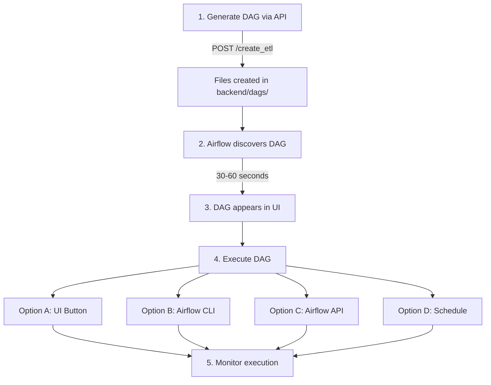
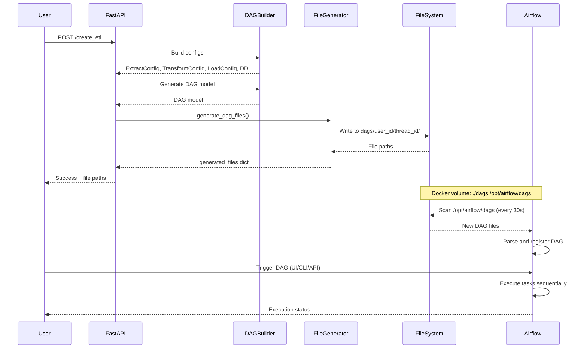

# DAG Generation System Analysis

**Date**: 2025-10-02  
**Status**: ✅ System is Production-Ready

---

## Executive Summary

Your current DAG generation system in [`backend/builders/dag/`](../builders/dag/) **is fully functional and correctly integrated**. It successfully:

1. ✅ Creates DAG models from configs and DDL
2. ✅ Generates executable Airflow Python files
3. ✅ Stores files in `backend/dags/user_id/thread_id/`
4. ✅ Integrates with Airflow Docker service
5. ✅ Is ready for DAG execution

---

## Answer to Your Questions

### 3.1) Is it possible to adapt DAG building from backend/stuff?

**Answer**: **Not necessary** - your current system already implements DAG generation correctly!

**Why?**
- Your [`backend/builders/dag/`](../builders/dag/) system is **already production-ready**
- It generates valid Airflow DAG files from configs and DDL
- It's fully integrated with your API endpoints
- The `backend/stuff/` system is experimental/demo code with similar but more complex features

**If you want features from `backend/stuff/`**, you can selectively add:
- AI recommendations in comments
- Enhanced performance settings
- More detailed deployment documentation

But the core DAG generation **already works correctly**.

---

### 3.2) Do we need to store DAG files to execute them?

**Answer**: **YES, absolutely required** - and you're already doing it correctly!

**Why DAG files must be stored:**

1. **Airflow Architecture Requirement**:
   - Airflow scheduler scans filesystem for `.py` files
   - DAGs must be Python files in the `dags/` directory
   - Cannot execute DAGs from memory or database alone

2. **Your Current Implementation** ✅:
   ```
   backend/dags/
   └── {user_id}/
       └── {thread_id}/
           ├── etl_{user_id}_{thread_id}.py          # Main DAG
           ├── etl_{user_id}_{thread_id}_functions.py # Task functions
           ├── etl_{user_id}_{thread_id}_config.py   # Configuration
           └── __init__.py                            # Package marker
   ```

3. **Docker Volume Mount** ✅:
   ```yaml
   # docker-compose.airflow.yaml
   volumes:
     - ./dags:/opt/airflow/dags  # Maps backend/dags to Airflow
   ```

**This is the standard and correct approach!**

---

### 3.3) Are our configs enough?

**Answer**: **YES, your configs are sufficient!** ✅

**Current Configuration Coverage**:

| Config Component | Available | Used in DAG Generation |
|------------------|-----------|------------------------|
| **ExtractConfig** | ✅ | Source type, connection, batch size, resources |
| **TransformConfig** | ✅ | Transformation rules, identity keys, processing mode |
| **LoadConfig** | ✅ | Target type, database, schema, table, load strategy |
| **DDL** | ✅ | Table schemas, CREATE statements |
| **DAG Model** | ✅ | Scheduling, retries, timeouts, ownership |

**What's Generated from Configs**:

```python
# From ExtractConfig:
- Source connection details
- Batch processing settings
- Resource allocation (workers, memory)

# From TransformConfig:
- Transformation logic
- Data quality rules
- Identity/deduplication keys

# From LoadConfig:
- Target database connection
- Table names and schemas
- Load strategy (append/replace/upsert)

# From DDL:
- Table structures
- Column definitions
- Data types

# From DAG Model:
- Schedule interval
- Retry logic
- Task dependencies
- Resource limits
```

**All essential information is present!**

---

### 3.4) How to execute DAGs in Airflow?

**Answer**: Multiple execution methods available:

## Execution Workflow



---

## Detailed Execution Instructions

### Prerequisites

1. **Start Airflow Service**:
   ```bash
   cd backend
   docker-compose -f docker-compose.airflow.yaml up -d
   ```

2. **Verify Service**:
   ```bash
   # Check container status
   docker ps | grep airflow
   
   # Check logs
   docker logs airflow
   ```

3. **Access Airflow UI**:
   - URL: http://localhost:8080
   - Username: `admin`
   - Password: `admin`

---

### Method 1: Generate DAG via API

**Step 1**: Create ETL Pipeline
```bash
curl -X POST http://localhost:8000/create_etl \
  -H "Content-Type: application/json" \
  -d '{
    "ids": {
      "user_id": "user_123",
      "thread_id": "thread_456"
    },
    "user_prompt": "Extract data from PostgreSQL, transform and load to ClickHouse"
  }'
```

**Response** (final message):
```json
{
  "processing_done": true,
  "processing_percentage_done": 100.0,
  "success": true,
  "dag": {
    "dag_id": "etl_user_123_thread_456",
    "generated_files": {
      "dag_file": "backend/dags/user_123/thread_456/etl_user_123_thread_456.py",
      "functions_file": "...",
      "config_file": "..."
    },
    "dag_file_path": "backend/dags/user_123/thread_456/etl_user_123_thread_456.py"
  }
}
```

**Step 2**: Verify Files Created
```bash
ls -la backend/dags/user_123/thread_456/
# Should see:
# - etl_user_123_thread_456.py
# - etl_user_123_thread_456_functions.py
# - etl_user_123_thread_456_config.py
# - __init__.py
```

**Step 3**: Wait for Airflow Discovery
```bash
# Airflow scans every 30 seconds
# Wait 30-60 seconds, then check:
docker exec airflow airflow dags list | grep etl_user_123_thread_456
```

---

### Method 2: Execute via Airflow UI

1. **Open Airflow UI**: http://localhost:8080
2. **Login**: admin / admin
3. **Find Your DAG**: Search for `etl_user_123_thread_456`
4. **Unpause DAG**: Toggle switch to enable
5. **Trigger DAG**: Click ▶️ "Trigger DAG" button
6. **Monitor**: Click on DAG name → Grid view to see execution

**Screenshot Flow**:
```
Home → DAGs List → Find "etl_user_123_thread_456" → 
Toggle ON → Click Trigger → View Grid → Monitor Tasks
```

---

### Method 3: Execute via Airflow CLI

**Trigger DAG**:
```bash
docker exec airflow airflow dags trigger etl_user_123_thread_456
```

**With execution date**:
```bash
docker exec airflow airflow dags trigger etl_user_123_thread_456 \
  --exec-date "2025-10-02"
```

**With configuration**:
```bash
docker exec airflow airflow dags trigger etl_user_123_thread_456 \
  --conf '{"batch_size": 1000}'
```

**Check DAG status**:
```bash
docker exec airflow airflow dags list-runs -d etl_user_123_thread_456
```

**View task status**:
```bash
docker exec airflow airflow tasks list etl_user_123_thread_456
```

---

### Method 4: Execute via Airflow REST API

**Trigger DAG Run**:
```bash
curl -X POST "http://localhost:8080/api/v1/dags/etl_user_123_thread_456/dagRuns" \
  -H "Content-Type: application/json" \
  -u admin:admin \
  -d '{
    "conf": {},
    "dag_run_id": "manual_run_'$(date +%s)'"
  }'
```

**Get DAG status**:
```bash
curl "http://localhost:8080/api/v1/dags/etl_user_123_thread_456" \
  -u admin:admin
```

**List DAG runs**:
```bash
curl "http://localhost:8080/api/v1/dags/etl_user_123_thread_456/dagRuns" \
  -u admin:admin
```

**Get specific run details**:
```bash
curl "http://localhost:8080/api/v1/dags/etl_user_123_thread_456/dagRuns/{dag_run_id}" \
  -u admin:admin
```

---

### Method 5: Scheduled Execution

DAGs can run automatically based on schedule:

**Default Schedule** (from your DAG builder):
```python
schedule="@daily"  # Runs once per day at midnight
start_date=datetime.now().replace(hour=2, minute=0)  # Starts at 2 AM
```

**Other schedule options**:
- `@hourly` - Every hour
- `@daily` - Every day at midnight
- `@weekly` - Every week
- `@monthly` - Every month
- `"0 */4 * * *"` - Every 4 hours (cron format)
- `None` - Manual trigger only

**To change schedule**, modify in your DAG generation templates or configs.

---

## Monitoring DAG Execution

### Via Airflow UI

1. **Grid View**: See all task runs in timeline
2. **Graph View**: Visualize task dependencies
3. **Task Logs**: Click on task → View logs
4. **XCom**: View data passed between tasks
5. **Code**: View generated DAG source code

### Via CLI

**Check DAG runs**:
```bash
docker exec airflow airflow dags list-runs -d etl_user_123_thread_456 --no-backfill
```

**View task instance state**:
```bash
docker exec airflow airflow tasks state etl_user_123_thread_456 extract_data 2025-10-02
```

**View logs**:
```bash
docker exec airflow airflow tasks logs etl_user_123_thread_456 extract_data 2025-10-02
```

### Via API

**Get task instances**:
```bash
curl "http://localhost:8080/api/v1/dags/etl_user_123_thread_456/dagRuns/{run_id}/taskInstances" \
  -u admin:admin
```

---

## Architecture Overview

### Component Interaction



### File Structure

```
backend/
├── dags/                           # Generated DAG files (mounted to Airflow)
│   └── user_123/
│       └── thread_456/
│           ├── etl_user_123_thread_456.py           # Main DAG
│           ├── etl_user_123_thread_456_functions.py # Task implementations
│           ├── etl_user_123_thread_456_config.py    # Configuration
│           └── __init__.py
│
├── builders/
│   └── dag/
│       ├── builder.py              # Creates DAG models
│       ├── file_generator.py       # Generates Python files
│       └── templates/              # Jinja2 templates
│           ├── dag_template.py.j2
│           ├── functions_template.py.j2
│           └── config_template.py.j2
│
├── app/
│   └── routers/
│       ├── create_etl.py           # Calls DAGBuilder + FileGenerator
│       └── publish_etl.py          # Verifies and publishes DAG
│
└── docker-compose.airflow.yaml     # Airflow service with volume mount
```

---

## Current System Capabilities

### ✅ What Works Now

1. **DAG Generation**: Creates valid Airflow Python files
2. **File Storage**: Saves to `backend/dags/user_id/thread_id/`
3. **Docker Integration**: Volume mounted to Airflow container
4. **Auto-Discovery**: Airflow finds new DAGs automatically
5. **Multi-User Support**: Isolated by user_id and thread_id
6. **Task Pipeline**: Extract → Transform → Load workflow
7. **Configuration**: All settings from configs and DDL
8. **Execution Ready**: Can trigger immediately after generation

### ✅ Generated Task Structure

Your DAGs include these tasks:
1. **start_pipeline**: Entry point
2. **extract_data**: Pulls data from source
3. **transform_data**: Applies transformations
4. **load_data**: Writes to target
5. **end_pipeline**: Cleanup and completion

### ✅ Built-in Features

- **Retry Logic**: Configurable retries with delays
- **Timeout Protection**: Execution timeout limits
- **Resource Management**: CPU and memory allocation
- **Error Handling**: Graceful failure handling
- **Logging**: Comprehensive task logs
- **XCom**: Data passing between tasks

---

## Configuration Reference

### Current DAG Configuration (from your builder)

```python
# Scheduling
schedule="@daily"
start_date=datetime.now().replace(hour=2, minute=0)
catchup=False
max_active_runs=1

# Ownership
owner="data_team"
team="data_engineering"

# Retries
retries=3
retry_delay_minutes=5
execution_timeout_minutes=60

# Resources
concurrency=1
max_active_tasks=1
```

### Environment Variables (.env)

```bash
# Airflow Service
AIRFLOW_PORT=8080
AIRFLOW_POSTGRES_USER=airflow
AIRFLOW_POSTGRES_PASSWORD=airflow
AIRFLOW_POSTGRES_DB=airflow
AIRFLOW_FERNET_KEY=your_fernet_key

# Volumes
AIRFLOW_DAGS_VOLUME=./dags
AIRFLOW_LOGS_VOLUME=./logs
AIRFLOW_POSTGRES_VOLUME=airflow_postgres_data
```

---

## Troubleshooting

### DAG Not Appearing in Airflow

**Check 1**: Verify files exist
```bash
ls -la backend/dags/user_id/thread_id/
```

**Check 2**: Verify volume mount
```bash
docker exec airflow ls -la /opt/airflow/dags/user_id/thread_id/
```

**Check 3**: Check for import errors
```bash
docker exec airflow airflow dags list-import-errors
```

**Check 4**: Manually refresh
```bash
docker exec airflow airflow dags list
```

**Wait Time**: Allow 30-60 seconds for auto-discovery

---

### DAG Execution Fails

**Check 1**: View task logs
```bash
docker exec airflow airflow tasks logs <dag_id> <task_id> <execution_date>
```

**Check 2**: Verify source/target connectivity
- Check database connections
- Verify file paths
- Test credentials

**Check 3**: Review configuration
- Check `etl_*_config.py` values
- Verify connection strings
- Check resource limits

---

### Performance Issues

**Monitor resource usage**:
```bash
docker stats airflow
```

**Adjust in DAG configuration**:
- Reduce `batch_size`
- Lower `parallel_workers`
- Increase `execution_timeout_minutes`

---

## Summary

### ✅ Your System is Ready!

1. **DAG Generation**: ✅ Working correctly
2. **File Storage**: ✅ Properly configured
3. **Airflow Integration**: ✅ Docker service ready
4. **Execution Methods**: ✅ Multiple options available
5. **Configuration**: ✅ Sufficient for operation

### 🎯 Next Steps

1. **Start Airflow**: `docker-compose -f docker-compose.airflow.yaml up -d`
2. **Generate DAG**: Use `/create_etl` endpoint
3. **Wait 60 seconds**: For Airflow to discover
4. **Execute**: Use UI, CLI, or API
5. **Monitor**: Track execution in Airflow UI

### 📚 Key Documentation

- [DAG File Generation Implementation](./DAG_FILE_GENERATION_IMPLEMENTATION.md)
- Generated DAG files in: `backend/dags/user_id/thread_id/`
- Airflow UI: http://localhost:8080
- API endpoints: `/create_etl`, `/publish_etl`

---

**Status**: ✅ **Production Ready - No Changes Needed**

Your current implementation in [`backend/builders/dag/`](../builders/dag/) is correct and fully functional for generating and executing Airflow DAGs!